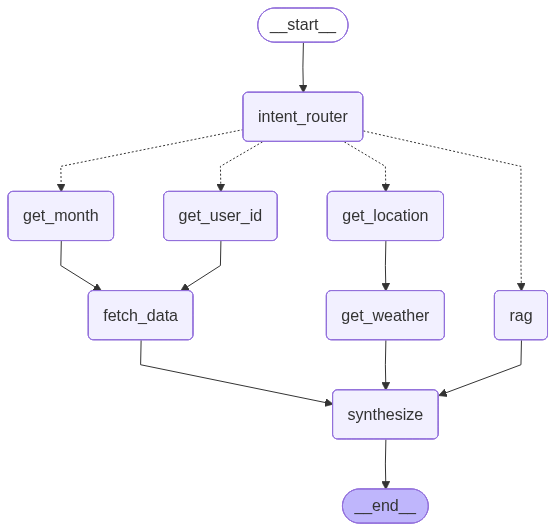

# Graph 架构设计文档

## 一、背景：原 ReAct 架构的问题

原架构使用 `create_agent` 创建一个 ReAct Agent，所有工具调用顺序完全由 LLM 自主决定：

```
用户 Query
    ↓
ReactAgent (LLM 自主决策)
    ↓
[工具池]: rag_summarize / get_user_location / get_weather /
          get_user_id / get_current_month / fetch_external_data /
          fill_context_for_report
    ↓
Middleware 拦截 (monitor_tool / log_before_model / report_prompt_switch)
    ↓
流式输出
```

**核心问题**：工具间存在隐含依赖（如 `get_weather` 依赖 `get_user_location` 的输出），这些依赖靠 LLM 推理维护，不可控、不可审计。

---

## 二、工具间真实数据依赖

```
ip (来自 metadata)
  └─► get_user_location(ip) ──► city, lat, lon
                                    └─► get_weather(city, lat, lon)

get_user_id() ──────────────┐
                             ├─► fetch_external_data(user_id, month)
get_current_month() ─────────┘

rag_summarize(query) ──► RAG 知识库检索结果

fill_context_for_report() ──► 触发 context["report"]=True
                                  └─► report_prompt_switch 切换 system prompt
```

Graph 架构的目标：将上述隐含依赖**显式编码为图的边**。

---

## 三、Graph 节点设计

### State 定义

```python
class GraphState(TypedDict):
    query: str
    ip: str
    location: dict        # city, lat, lon
    weather: str
    user_id: str
    month: str
    external_data: str
    rag_result: str
    is_report: bool
    messages: list
    final_response: str
    classification: QueryClassification
```

### 节点列表

| 节点 | 职责 | 对应原工具/中间件 |
|------|------|-----------------|
| `intent_router` | LLM 分析 query 意图，通过 `Command(goto=...)` 动态路由 | LLM 判断（原来隐式） |
| `get_location` | 根据 IP 获取城市/经纬度 | `get_user_location` |
| `get_weather` | 根据经纬度获取天气 | `get_weather_tool` |
| `get_user_id` | 获取用户 ID | `get_user_id_tool` |
| `get_month` | 获取当前月份 | `get_current_month` |
| `fetch_data` | 获取外部用户数据 + 触发报告标记 | `fetch_external_data` + `fill_context_for_report` |
| `rag` | RAG 检索知识库 | `rag_summarize` |
| `synthesize` | 汇总上下文，根据 `is_report` 切换 prompt，生成最终回答 | LLM + `log_before_model` + `report_prompt_switch` |

### Middleware 的归宿

| 原 Middleware | Graph 中的位置 |
|--------------|---------------|
| `monitor_tool` | 每个 node 函数内部的日志逻辑 |
| `log_before_model` | `synthesize` 节点调用 LLM 前执行 |
| `report_prompt_switch` | `synthesize` 节点内读取 `state["is_report"]` 切换 prompt |

---

## 四、图结构与节点关系

下图由 LangGraph 自动生成，展示了完整的节点拓扑和路由关系：



### 路由逻辑

`intent_router` 使用 LLM 结构化输出对用户意图进行分类，通过 `Command(goto=...)` 动态路由到不同节点组合：

| 意图 | 路由目标 | 执行路径 |
|------|---------|---------|
| `weather` | `get_location` | `get_location` → `get_weather` → `synthesize` |
| `report` | `get_user_id`, `get_month`（并行） | `get_user_id` → `fetch_data` → `synthesize`；`get_month` → `fetch_data` → `synthesize` |
| `product` | `rag` | `rag` → `synthesize` |
| `complex` | `get_location`, `rag`, `get_user_id`, `get_month`（并行） | 所有路径并行执行后汇聚到 `synthesize` |

### 关键设计说明

- **动态路由**：`intent_router` 使用 LangGraph 的 `Command(goto=...)` 机制实现运行时动态分发，无需预先声明条件边
- **并行执行**：`goto` 接受列表参数，LangGraph 自动并行调度多个目标节点
- **节点间跳转**：每个中间节点通过 `Command(goto=...)` 指定下一跳，形成链式执行路径
- **汇聚点**：所有路径最终汇聚到 `synthesize` 节点，由 LLM 综合所有上下文生成回答

---

## 五、文件组织架构

### 目录结构

```
agent/
  state.py          # GraphState TypedDict 定义
  nodes.py          # 所有 node 函数（对 tools 的图层面薄包装，通过 Command 路由）
  workflow.py       # StateGraph 组装（声明节点和入口/终止边），返回 CompiledStateGraph
  react_agent.py    # 原 ReAct Agent（已弃用，保留备查）
  tools/
    agent_tools.py  # 纯业务逻辑（@tool 装饰，可独立测试和复用）
    middleware.py   # 原 middleware 定义（已弃用，逻辑内联到 nodes.py）

app.py              # Streamlit 入口，调用 workflow.py 暴露的 compiled graph
```

### 各文件职责

**`agent/state.py`**
- 定义 `GraphState` 和 `QueryClassification`，作为所有节点间共享的数据契约

**`agent/tools/agent_tools.py`**
- 保留原有业务函数，使用 `@tool` 装饰器包装
- 节点通过 `.invoke()` 方法调用（如 `get_weather_tool.invoke({...})`）

**`agent/nodes.py`**
- 每个 node 函数接收 `GraphState`，调用 `tools/` 中的业务函数，返回 `Command` 或 `dict`
- `intent_router` 通过 `Command(goto=...)` 实现动态路由
- 中间节点通过 `Command(goto=...)` 指定下一跳
- `synthesize_node` 作为终止节点返回普通 `dict`

**`agent/workflow.py`**
- 声明节点、声明入口边（`START → intent_router`）和终止边（`synthesize → END`）
- 中间路由由各节点的 `Command(goto=...)` 驱动
- 暴露 `build_workflow() -> CompiledStateGraph`

**`app.py`**
- 调用 `build_workflow()` 获取 compiled graph
- 构造 `{"query": ..., "ip": ...}` 初始状态
- 通过 `workflow.invoke(initial_state)` 执行，从 `result["final_response"]` 获取回答
